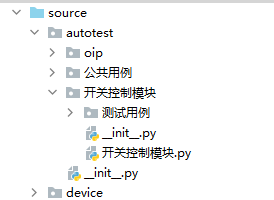
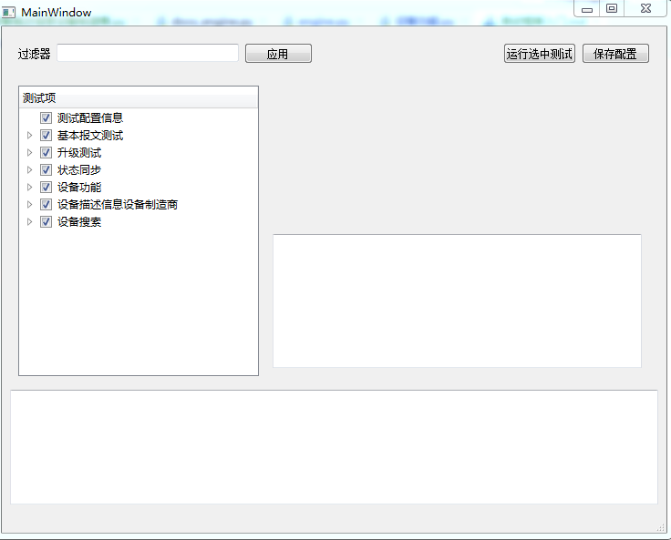
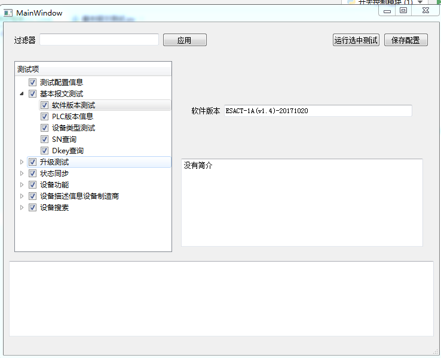

# 自动用例编写三则

## 环境准备

1. 安装[tortoisegit](https://tortoisegit.org/download/)

2. 下载代码 
```shell script
git clone http://192.168.37.176/yuantl/protocolmaster.git
```

3.准备一个开关控制模块、一个抄控器和usb转串口。（抄控器需要提前烧写李瑞芹提供的程序）

## 开发环境准备

1. 更改python源。
2. 使用命令行安装
```shell script
pip install -r requirements.txt
```

## 测试之禅

- **提前优于滞后**。要和产品经理了解项目需求，提前设计好自动化测试方案，对研发产品提出要求，在程序上给与对应支持。
- **自动胜于手动**。能自动化测试的项目，就不要手动测试。能自动完成的任务，就不要手动完成。
- **制度累积知识**。要靠制度(测试用例，工装，成体系的测试方法)传承，累积知识，提高测试质量。
- **要比上次做的更好**。每次测试都要思考，能否比上次做的更好，及时改进方法，提高水平。

# 建立一个测试工程

- 在autotest文件夹下创建`开关控制模块`Python Package。Python Package和普通文件夹区别是其有名字为`__init__.py`的文件。
这个文件存在表示这个文件夹是python的源码文件。也可以手动创建文件夹，然后再手动创建`__init__.py`
- 在`开关控制模块`文件夹下创建`测试用例`Python Package。这个文件夹存放和本项目相关的测试用例。
- 在`开关控制模块`文件夹下创建`开关控制模块.py` 作为测试工程的入口。并填写如下代码

```python
#encoding:utf-8
# 导入测试引擎
import engine

#配置测试串口
config = dict()
config["测试程序名称"] = r"ESACT-1A(v1.4)-20171020"
config["串口"] = "COM9"
config["波特率"] = "9600"
config["校验位"] = 'None'
config["抄控器默认源地址"] = 1
config["测试设备地址"] = 76744
config["设备密码"] = 19443
config["panid"] = 22
engine.config(config)

if __name__ == "__main__":
    import os
    # 设置测试文档的输出目录，默认输出到 开关控制模块 文件夹下
    engine.set_output_dir(os.path.dirname(__file__))    
    engine.run_all_tests(gui=True)
```
其实，自动化测试脚本和上位机的运行的要素都是一样的。使用上位机的时候要指定波特率，源地址，目的地址，使用自动化测试脚本也要指定这些要素。上面这些文件就是使用脚本指定这些要素的方式。

上述步骤完成之后，目录结构如下：

 

## 第一个测试用例
  对于开关控制模块，最简单的测试就是软件版本号测试。读取并判断软件版本号我们可以使用一下方式。
  - 查阅 `resource/数据表示分类表格`，确定测试使用的did名称为`设备描述信息设备制造商`
  - 编写发送代码 `engine.send_did("READ", "设备描述信息设备制造商")`
  - 编写检测代码 `engine.expect_did("READ", "设备描述信息设备制造商", "ESACT-1A(v1.4)-20171020")`
  - 运行`开关控制模块.py`查看程序，并查看测试报告。
  - 完整测试用例代码如下：
  
```python
import engine
def test_software_version():
    "开关电源模块软件版本"
    engine.send_did("READ", "设备描述信息设备制造商")
    engine.expect_did("READ", "设备描述信息设备制造商", "ESACT-1A(v1.4)-20171020")
```

## 多个did测试

```python
import engine
def test_multi_dids():
    "多DID测试"
    engine.send_multi_dids("READ", "DKEY", "", "SN", "", "设备类型", "")
    engine.expect_multi_dids("READ",
                             "DKEY", "** ** ** ** ** ** ** **",
                             "SN", "** ** ** ** ** ** ** ** ** ** ** **",
                             "设备类型","** ** ** ** ** ** ** **",
                             timeout=3)
```

## 用来命令行运行和gui运行
将`开关控制模块.py` 中  ` engine.run_all_tests(gui=False)` 改为` engine.run_all_tests(gui=True)` 就可以显示gui界面。


单击测试-右键-运行测试- 便可以运行单个测试。

## 上报测试方法


```python
import engine

测试组说明="测试状态同步代码"

def start_report():
    r"4aid+2panid+2pw+4gid+2sid"
    config = engine.get_config()
    engine.send_local_msg("设置PANID", config["panid"])
    engine.expect_local_msg("确认")
    engine.send_did("WRITE", "载波芯片注册信息",
                    aid=config["测试设备地址"],
                    panid=config["panid"],
                    pw=config["设备密码"],
                    gid=1,
                    sid=1)
    engine.expect_did("WRITE", "载波芯片注册信息", "** ** ** ** ** **")


def test_gateway_report():
    """
    组网上报
    测试设备组网上报功能。
    1. 将设备上报模式设置为上报网关
    2. 发起模拟设备组网命令。
    3. 设备会在65s内上报开关状态
    4. 如果没有收到回复，设备会重发两次
    5. 收到回复时，设备便不再重发
    """
    engine.send_did("WRITE", "主动上报使能标志",传感器类型="开关", 上报命令="上报网关")
    engine.expect_did("WRITE", "主动上报使能标志", 传感器类型="开关", 上报命令="上报网关")

    start_report()
    engine.add_doc_info("设备会在65s内第一次上报")
    engine.expect_multi_dids("REPORT", "通断操作C012", "**","导致状态改变的控制设备AID", "** ** ** **", timeout=65)
    engine.add_doc_info("设备会在200s内第二次上报")
    engine.wait(50, expect_no_message=True)
    engine.expect_multi_dids("REPORT", "通断操作C012", "**","导致状态改变的控制设备AID", "** ** ** **", timeout=200)
    engine.add_doc_info("设备会在350s内第三次上报")
    engine.wait(50, expect_no_message=True)
    engine.expect_multi_dids("REPORT", "通断操作C012", "**", "导致状态改变的控制设备AID", "** ** ** **", timeout=300)

    engine.add_doc_info("上报收到回复之后，便不会重发")
    start_report()
    engine.expect_multi_dids("REPORT", "通断操作C012", "**", "导致状态改变的控制设备AID", "** ** ** **", timeout=65, ack=True) # ack为True，上报自动回复，默认不回复。
    engine.wait(250, expect_no_message=True)
```

## 设备联动自动化方法 
    
```python
import engine

测试组说明="测试状态同步代码"

def start_report():
    r"4aid+2panid+2pw+4gid+2sid"
    config = engine.get_config()
    engine.send_local_msg("设置PANID", config["panid"])
    engine.expect_local_msg("确认")
    engine.send_did("WRITE", "载波芯片注册信息",
                    aid=config["测试设备地址"],
                    panid=config["panid"],
                    pw=config["设备密码"],
                    gid=1,
                    sid=1)
    engine.expect_did("WRITE", "载波芯片注册信息", "** ** ** ** ** **")

def test_subscribe_report():
    """
    只上报订阅者
    测试设备只上报订阅者模式。本测试需要经过如下几步：
    1. 首先将设备的上报模式设置为上报设备，
    2. 使用面板控制设备，面板就会自动成为设备的订阅者。
    3. 通过其他地址控制设备，设备会自动将状态信息上报给面板
    """
    engine.send_did("WRITE", "主动上报使能标志", 传感器类型="开关", 上报命令="上报设备")
    engine.expect_did("WRITE", "主动上报使能标志", 传感器类型="开关", 上报命令="上报设备")

    engine.add_doc_info("面板控制设备之后，会自动成为设备的订阅者，其他设备在控制开关控制器，开关控制器回向面板上报")
    panel = engine.create_role("订阅者1", 3) # 创建陪测设备
    panel.send_did("WRITE", "通断操作C012", "01")
    panel.expect_did("WRITE","通断操作C012","00")
    engine.send_did("WRITE", "通断操作C012", "81")
    engine.expect_did("WRITE", "通断操作C012", "01")
    panel.expect_did("REPORT", "通断操作C012","01",timeout=15,ack=True)
```

## 测试用例进阶

### 带参数的测试用例

测试用例可以带有参数，参数可以通过进行配置。带有参数的测试必须标注参数的类型。参数的类型需要在`protocol.DataMetaType`中定义。

```python
import engine
from protocol.DataMetaType import *

def test_software_version(软件版本:DataCString):
    "软件版本测试"
    engine.send_did("READ", "设备描述信息设备制造商")
    engine.expect_did("READ", "设备描述信息设备制造商", 软件版本)
```



### did参数类型

`engine.send_did`参数
    
- 可以传递字符串    
- 可以传递数字
- 可以传递hex字符串
- 可以使用key,value 
- 可以使用枚举字符串
    
```python
import engine
def test_c012():
    "开关测试"
    engine.send_did("WRITE", "通断操作C012", "81")
    engine.send_did("SEARCH", "APP设备搜索",dst=0xffffffff, 搜索类型="未注册节点", 搜索时间=14, 设备类型="ff ff ff ff")
```

`engine.expect_did`参数除了`engine.send_did`参数之后，还可以使用通配符和函数。

```python 
engine.expect_did("WRITE", "载波芯片注册信息", "** ** ** ** ** **")
```
     
### 增加详细说明

#### 组说明

    在测试文件中增加 `测试组说明="组说明文档"`，便可以在生成文件中增加组说明。
    
#### 测试用例详细说明.
  函数说明使用多行文档，便可以为测试用例增加说明。
  
```python
import engine
def test_onoff():
    """
    设备开关测试
    测试设备的通断功能是否正常。本测试首先控制通道1开启，然后在控制通道1关闭
    """
    engine.add_doc_info("bit7 bit6(on off) bit5-bit0选中通道")
    engine.add_doc_info("打开继电器 第一通道")
    engine.send_did("WRITE", "通断操作C012", "81")
    engine.expect_did("WRITE", "通断操作C012","01")
    engine.add_doc_info("关闭继电器 第一通道")
    engine.send_did("WRITE", "通断操作C012", "01")
    engine.expect_did("WRITE", "通断操作C012","00")
```

#### 测试过程说明
    使用`engine.add_doc_info("过程说明")`增加过程说明
 