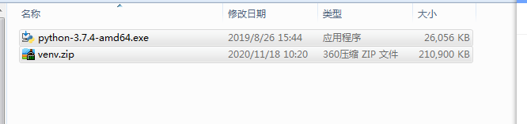
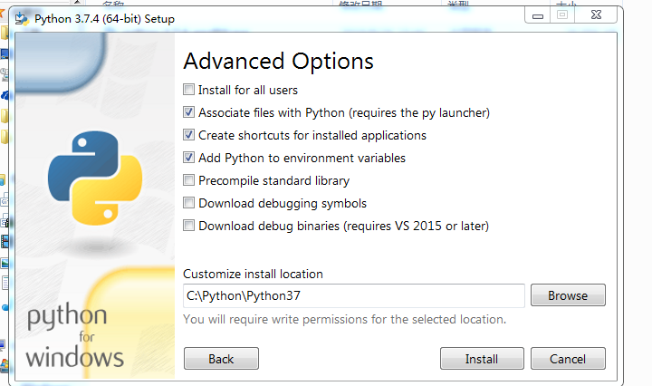
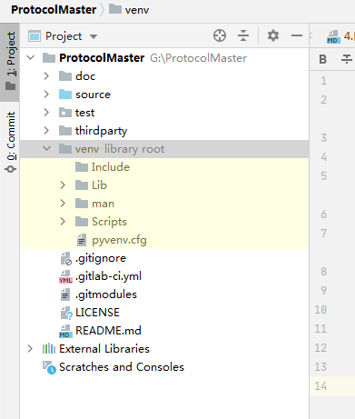
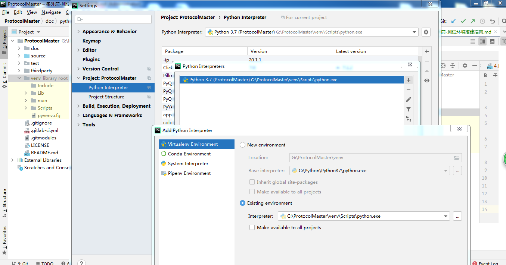

# 提前准备资料
venv环境和python3.7.4安装包
  
  
# 安装pycharm
  提前安装pycharm，安装社区版本即可，不用激活。[下载地址](https://www.jetbrains.com/pycharm/download/#section=windows)

# 安装python3.7.4解释器
  安装python3.7.4解释器。[下载地址](https://www.python.org/downloads/release/python-374/)
- 必须安装这一版本，否则容易产生兼容性问题。
- 安装时需要自动以安装到c根目录下，否则需要自己安装第三方库，自己排查环境搭建的问题。详细配置如下图：
 

# 配置解释器并测试
  - 工程目录的上层目录不能有中文
  - 将venv目录解压到工程目录下
   
  - 将解释器配置为venv开发环境下的解释器
   
  - 运行测试项目。测试项目能否正常工作。
    右键运行`开关控制模块.py`,测试项目能否正常运行。
    

# 手动配置环境方法
1. 安装第三方库
`requirements.txt`存放在source目录下。
```shell script
pip install -r requirements.txt
```

2. 卸载serial和pyserial，并重新安装pyserial
```shell script
pip uninstall serial 
pip uninstall pyserial
pip install pyserial
```