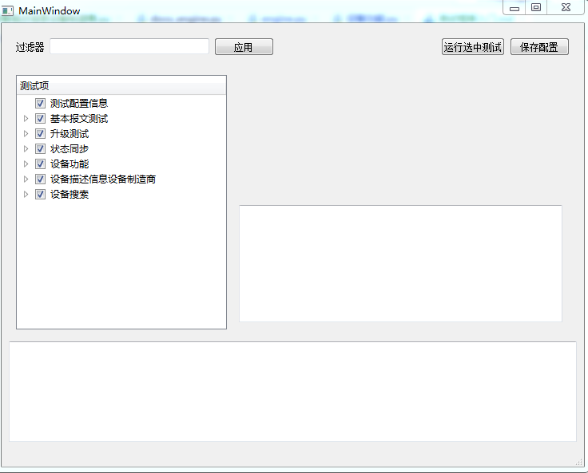
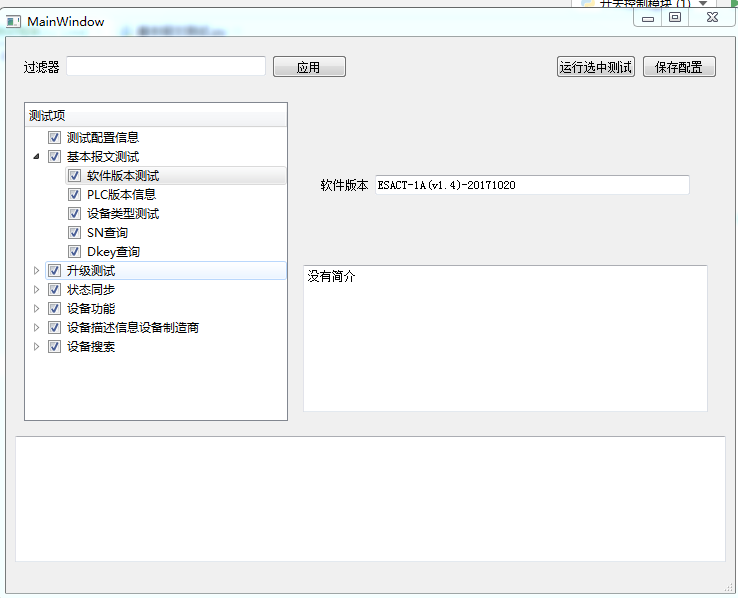

# 测试框架入门

# 框架简介

# 为啥要使用脚本

- 易于修改
- 可以自由表达逻辑
- 任意方式组合
- 易于自动运行

## 框架特性
  目前支持的特性：
  - 通过excel配置DID
  - 收发自动验证
  - 上报自动测试
  - 联动自动测试
  - 文档自动生成
  - gui浏览，配置和运行部分用例
  
## 将要支持的特性
  - 升级自动测试
  
## 测试用例组织
  测试用例的组织规则如下：
  - 测试用例分为公共用例和项目用例。公共用例是可以其他设备共用的测试用例，存放在`autotest/公共用例`文件夹下。项目用例存放在`autotest/项目名称`文件夹下。
  - 每个测试文件为一个测试组，项目文件名称就是测试组的名称。
  - 每个测试组可以有多个测试用例，每个测试用例的名称为test开头。


# 测试自动化实战

以下以开关控制器模块为例，创建一个自动化测试项目。

## 创建测试项目并增加配置信息
  - 在autotest文件夹下创建`开关控制模块`Python Package。Python Package和普通文件夹区别是其有名字为`__init__.py`的文件。
这个文件存在表示这个文件夹是python的源码文件。也可以手动创建文件夹，然后再手动创建`__init__.py`
  - 在`开关控制模块`文件夹下创建`测试用例`Python Package。这个文件夹存放和本项目相关的测试用例。
  - 在`开关控制模块`文件夹下创建`开关控制模块.py` 作为测试工程的入口。并填写如下代码：
```python
#encoding:utf-8
# 导入测试引擎
import engine

#配置测试串口
config = dict()
config["测试程序名称"] = r"ESACT-1A(v1.4)-20171020"
config["串口"] = "COM9"
config["波特率"] = "9600"
config["校验位"] = 'None'
config["抄控器默认源地址"] = 1
config["测试设备地址"] = 76744
config["设备密码"] = 19443
config["panid"] = 22
engine.config(config)

if __name__ == "__main__":
    import os
    # 设置测试文档的输出目录，默认输出到 开关控制模块 文件夹下
    engine.set_output_dir(os.path.dirname(__file__))    
    engine.run_all_tests(gui=True)
```
其实，自动化测试脚本和上位机的运行的要素都是一样的。使用上位机的时候要指定波特率，源地址，目的地址，使用自动化测试脚本也要指定这些要素。
上面这些文件就是使用脚本指定这些要素的方式。

## 第一个测试用例
  对于开关控制模块，最简单的测试就是软件版本号测试。读取并判断软件版本号我们可以使用一下方式。
  - 查阅 `resource/数据表示分类表格`，确定测试使用的did名称为`设备描述信息设备制造商`
  - 编写发送代码 `engine.send_did("READ", "设备描述信息设备制造商")`
  - 编写检测代码 `engine.expect_did("READ", "设备描述信息设备制造商", "ESACT-1A(v1.4)-20171020")`
  - 运行`开关控制模块.py`查看程序，并查看测试报告。
  - 完整测试用例代码如下：
```python
import engine
def test_software_version():
    "开关电源模块软件版本"
    engine.send_did("READ", "设备描述信息设备制造商")
    engine.expect_did("READ", "设备描述信息设备制造商", "ESACT-1A(v1.4)-20171020")
```
  如上图所示，每个测试为函数，函数的首行文档为测试用例名称。python中首函数定义的格式如下：
```
def 函数名():
    "函数注释"
    函数体
```
## 用来命令行运行和gui运行
将`开关控制模块.py` 中  ` engine.run_all_tests(gui=False)` 改为` engine.run_all_tests(gui=True)` 就可以显示gui界面。


单击测试-右键-运行测试- 便可以运行单个测试。

## 上报测试方法
    见`autotest/开关控制模块/状态同步-只上报订阅者`
    
## 设备联动自动化方法 
    见`autotest/开关控制模块/状态同步-组网上报`

## 测试用例进阶

### 带参数的测试用例

测试用例可以带有参数，参数可以通过进行配置。带有参数的测试必须标注参数的类型。参数的类型需要在`protocol.DataMetaType`中定义。
```python 
def test_software_version(软件版本:DataCString):
    "软件版本测试"
    engine.send_did("READ", "设备描述信息设备制造商")
    engine.expect_did("READ", "设备描述信息设备制造商", 软件版本)
```


### did参数类型

`engine.send_did`参数
    
- 可以传递字符串    
- 可以传递数字
- 可以传递hex字符串
- 可以使用key,value 
- 可以使用枚举字符串
    
```python 
engine.send_did("WRITE", "通断操作C012", "81")
engine.send_did("SEARCH", "APP设备搜索",dst=0xffffffff, 搜索类型="未注册节点", 搜索时间=14, 设备类型="ff ff ff ff")
```

`engine.expect_did`参数除了`engine.send_did`参数之后，还可以使用通配符和函数。

```python 
engine.expect_did("WRITE", "载波芯片注册信息", "** ** ** ** ** **")
```
     
### 增加详细说明

#### 组说明

    在测试文件中增加 `测试组说明="组说明文档"`，便可以在生成文件中增加组说明。
    
#### 测试用例详细说明.
  函数说明使用多行文档，便可以为测试用例增加说明。
```python
def test_onoff():
    """
    设备开关测试
    测试设备的通断功能是否正常。本测试首先控制通道1开启，然后在控制通道1关闭
    """
    engine.add_doc_info("bit7 bit6(on off) bit5-bit0选中通道")
    engine.add_doc_info("打开继电器 第一通道")
    engine.send_did("WRITE", "通断操作C012", "81")
    engine.expect_did("WRITE", "通断操作C012","01")
    engine.add_doc_info("关闭继电器 第一通道")
    engine.send_did("WRITE", "通断操作C012", "01")
    engine.expect_did("WRITE", "通断操作C012","00")
```
#### 测试过程说明
    使用`engine.add_doc_info("过程说明")`增加过程说明

## did配置表
   测试引擎通过解析`resouce/数据表示分类表格`did数据解析。当我们编写测试时，首先要查找`resouce/数据表示分类表格`，判断相当的did中的解析指南项是否被正确的填写。
   测试指南每一项是是一个由数据类型、属性和名称组成的三元组。
   
### 数据类型详解
   - u8 
   - u16 
   - u32
   - u8enum u8的枚举类型。枚举包含的详细信息可以参考数据表格`enums`
   - bytes 字节数组。例如设备类型
   - string 字符串。例如软件版本号
   - vs 自定义数据项。用户需要自己编写解析函数
   - f32.x(计划支持) 浮点数，x表示有几位小数，可以是0，1，2，3   

### 属性
   属性表示当前数据项在各个操作中是否存在。
   - r 支持读。读取传感器数据时，需要传递传感器类型。
   - w 支持写。写上报步长时，需要编写步长数据。
   - d 支持回复。

### 名称
   名称就是数据项的名称。使用key-value方式组织did数据时，名称作为key使用。 
主动上报使能标志的解析指南配置如下：

```
（u8enum,rwd,传感器类型)(u8enum,wd,上报命令）
```
读、写、回复的时候都有传感器类型，读的时候不需要上报命令。